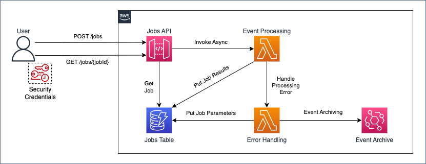

# Asynchronous Event Processing with API Gateway and Lambda

Sample architecture to process events asynchronously using API Gateway and Lambda.

## Architecture



In the following is a typical workflow:

1. The user authenticates against AWS Identity and Access Management (IAM) and obtains security credentials;
2. the user does an HTTP POST request to the `/jobs` jobs API endpoint, specifying in the request's body the job's parameters;
3. the jobs API Amazon API Gateway REST API returns to the user an HTTP response containing the job's identifier;
4. the jobs API invokes asynchronously the event processing AWS Lambda function;
5. the event processing function processes the event, then puts the job's results in the jobs Amazon DynamoDB table;
6. the user does an HTTP GET request to the `/jobs/{jobId}` jobs API endpoint, with the job's identifier from step 3. as `{jobId}`;
7. the jobs API queries the jobs table to retrieve the job's results;
8. the jobs API returns to the user an HTTP response containing the job's results.

If the event processing fails:

1. the event processing function sends the event to the error handling function;
2. the error handling function puts the job's parameters in the jobs Amazon DynamoDB table;
3. the user can retrieve the job's parameters by doing an HTTP GET request to the `/jobs/{jobId}` jobs API endpoint.

If the error handling fails:

1. the error handling function sends the event to an Amazon EventBridge archive;
2. the user can replay the archived events by using the related Amazon EventBridge feature.

## Prerequisites

Install on your workstation the following tools:

- [AWS Cloud Development Kit (CDK) Toolkit](https://docs.aws.amazon.com/cdk/v2/guide/cli.html) version `2.54.0`;
- [Docker](https://docs.docker.com/get-docker/) version `20.10.21`;
- [Node.js](https://nodejs.org/en/download/) version `18.12.1`;
- [Projen](https://pypi.org/project/projen/) version `0.65.58`.

You should also own or have access to an [AWS account](https://docs.aws.amazon.com/accounts/latest/reference/manage-acct-creating.html).

## Setup

Execute the following steps on your workstation:

- clone this repository;
- change directory to the repository's root:

```bash
cd asynchronous-event-processing-api-gateway-api-gateway-lambda-cdk
```

- setup the project using [Projen](https://github.com/projen/projen):

```bash
npx projen
```

- activate the [Python's virtual environment](https://docs.python.org/3/library/venv.html):

```bash
source .env/bin/activate
```

- install the [pre-commit](https://pre-commit.com/) hooks:

```bash
pre-commit install
pre-commit install --hook-type commit-msg
```

## Test

To run the project's tests execute:

```bash
npx projen test
```

## Lint

To lint the project's code execute:

```bash
npx projen synth
npx projen lint
```

## Scan

To perform a security scan of the project's code execute:

```bash
npx projen synth
npx projen scan
```

## Release

Execute the following steps on your workstation:

- change the value of `__version__` in `.projenrc.py` (follow [PEP440](https://peps.python.org/pep-0440/) specification)

```python
...
__version__ = "1.0.0"
...
```

- update [Projen](https://github.com/projen/projen)'s task definitions:

```bash
npx projen
```

- release a new version using [Projen](https://github.com/projen/projen):

```bash
npx projen release
```

- push to remote, including tags:

```bash
git push
git push --tags
```

## Bootstrap

To bootstrap the [AWS CDK](https://aws.amazon.com/cdk/) in your AWS account execute:

```bash
AWS_PROFILE=$YOUR_AWS_PROFILE npx projen bootstrap
```

## Deployment

To deploy your application in your AWS account execute:

```bash
AWS_PROFILE=$YOUR_AWS_PROFILE npx projen deploy
```

## Cleanup

To cleanup your application in your AWS account execute:

```bash
AWS_PROFILE=$YOUR_AWS_PROFILE npx projen destroy
```

## Try it out

To try the sample architecture included in this repository proceed to:

- perform a [deployment](#deployment) in your AWS account;
- install on your workstation the [AWS Command Line Interfact (CLI)](https://docs.aws.amazon.com/cli/latest/userguide/getting-started-install.html);
- [assume](https://awscli.amazonaws.com/v2/documentation/api/latest/reference/sts/assume-role.html) the `JobsAPIInvokeRole` printed as output from the deploy command;
- install [Postman](https://www.postman.com/downloads/) on your workstation;
- [import](https://learning.postman.com/docs/getting-started/importing-and-exporting-data/) the [Postman collection](./postman_collection.json) included in this repository;
- [set](https://learning.postman.com/docs/sending-requests/variables/) the `JobsAPI` variables as following:
  - `accessKey`: value of the `Credentials.AccessKeyId` attribute from the `assume-role` command;
  - `baseUrl`: value of the `JobsApiJobsAPIEndpoint` output from the deploy command **without trailing slash**;
  - `region`: value of the [AWS Region](https://docs.aws.amazon.com/AWSEC2/latest/UserGuide/using-regions-availability-zones.html#concepts-regions) where you deployed the sample architecture;
  - `seconds`: a positive integer of your choice;
  - `secretKey`: value of the `Credentials.SecretAccessKey` attribute from the `assume-role` command;
  - `sessionToken`: value of the `Credentials.SessionToken` attribute from the `assume-role` command;
- test the sample architecture by [sending requests](https://learning.postman.com/docs/sending-requests/requests/#next-steps) to the jobs API.

## Security

See [CONTRIBUTING](CONTRIBUTING.md#security-issue-notifications) for more information.

## License

This library is licensed under the MIT-0 License. See the LICENSE file.
